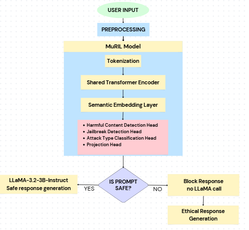

# Hindi LLM Safety Framework
### A Robust Jailbreak Defense and Safety Alignment Framework for Low-Resource Large Language Models

---

## Overview

This project presents a production-ready LLM Safety Gateway 
specifically designed for Hindi, Hinglish, and mixed-script 
Indic language inputs — an underexplored yet critical domain 
in AI safety research. The system detects harmful content, 
jailbreak attacks, and obfuscated prompts in real time, and 
generates contextually appropriate bilingual ethical refusals 
for blocked prompts.

---

## Problem Statement

Large Language Models (LLMs) like LLaMA are highly vulnerable 
to jailbreak attacks and harmful prompt injections in 
low-resource languages. Existing safety frameworks are 
primarily designed for English, leaving Hindi and Hinglish 
users and deployments unprotected. This project addresses 
that gap by building a complete safety pipeline specifically 
for Indic language LLM inputs.

---
## Architecture

## Features

- **Multi-Task MuRIL Classifier** — single shared encoder 
  with three parallel classification heads for harmful 
  content, jailbreak detection, and attack type taxonomy

- **9-Technique Obfuscation Pipeline** — detects and decodes 
  Base64, leet-speak, zero-width character injection, URL 
  encoding, hex encoding, homoglyph substitution, mixed-script 
  attacks, spaced characters, and token smuggling

- **Supervised Contrastive Learning** — SupConLoss with 
  128-dim projection head structures the embedding space 
  into semantically distinct attack-type clusters

- **Learnable Multi-Task Uncertainty Weighting** — Kendall 
  et al. formulation replaces manual loss balancing with 
  learnable task-specific uncertainty parameters

- **FAISS Semantic Deduplication** — removes near-duplicate 
  training samples using cosine similarity threshold of 0.95

- **FPR-Constrained Threshold Optimization** — val-set 
  optimized thresholds with FPR ≤ 1% for harmful and 
  FPR ≤ 0.5% for jailbreak detection

- **Ethical Response Engine** — attack-type conditioned 
  bilingual (Hindi + English) refusal generation using 
  deterministic hard templates backed by LLaMA-generated 
  contextual explanations

- **Two-GPU Deployment** — MuRIL on GPU 0, LLaMA-3.2-3B 
  (NF4 4-bit quantized) on GPU 1, served via Gradio

---
